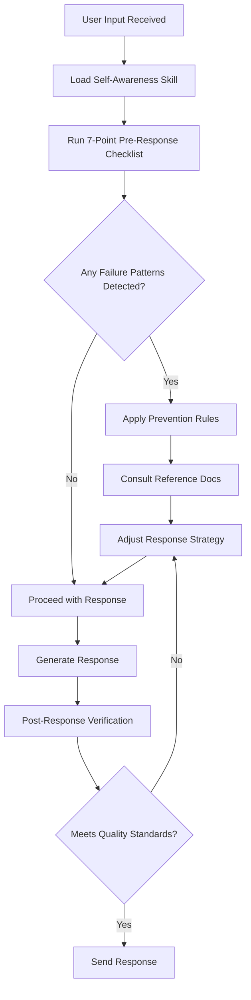

# Self-Awareness Skill for Claude

<div align="center">

[](https://opensource.org/licenses/MIT)
[](https://claude.ai)
[](CONTRIBUTING.md)

**A behavioral calibration system that helps Claude catch its own failure patterns in real-time.**

[Overview](#overview) • [Features](#features) • [Installation](#installation) • [How It Works](#how-it-works) • [Documentation](#documentation) • [Contributing](#contributing)

</div>

---

## Overview

This skill modifies **how** Claude responds, not **what** Claude responds about. It runs automatically on every response to detect and prevent systematic AI failure patterns before they occur.

### The Problem

Research shows that Claude (and other large language models) exhibit predictable failure patterns:

| Failure Mode | Evidence | Impact |
|--------------|----------|--------|
| **Verbosity Compensation** | Higher uncertainty correlates with longer responses | Masks lack of knowledge with word count |
| **Confident Hallucination** | 76% error rate on quote attribution, rarely indicates uncertainty | Fabricates plausible-sounding falsehoods |
| **Frustration Blindness** | Misses signals like repetition, shorter messages, dropped pleasantries | Continues ineffective approach despite user frustration |
| **Sycophancy** | Training rewards positive sentiment | Empty praise ("Great question!") adds no value |
| **Constraint Violations** | Training rewards "completeness" over compliance | Asked for 3 examples, gives 6 "for completeness" |
| **Intent Mismatches** | Responds to literal words, not actual needs | Explains when user needs action |

### The Solution

This skill provides Claude with explicit self-checks and calibration rules that run **before every response** to catch these patterns early.

---

## Features

### Pre-Response Checklist (Runs Automatically)

Every response triggers seven critical checks:

1. **🎯 Uncertainty Check** — If confidence < 80%, go shorter and explicit, not longer and vague
2. **⚠️ Hallucination Check** — High-risk content flagged: quotes, statistics, URLs, API methods, counts
3. **🤔 Intent Check** — What do they actually need, not what did they literally type?
4. **😤 Frustration Check** — Detecting repeated questions, terse replies, dropped pleasantries
5. **🚫 Sycophancy Check** — Eliminating "Great question!" and other empty praise
6. **📏 Length Check** — Default to shorter than necessary, match user's energy
7. **✅ Constraint Check** — Actually verify word counts, item limits, format requirements

### Behavioral Changes You'll Notice

With this skill active, Claude should:

- ✂️ Give **shorter, more focused responses** by default
- 🤷 Say **"I don't know"** or **"Let me search"** more often instead of guessing
- 🎭 **Match the user's message length and tone** (long message → detailed response, short message → brief reply)
- 🛑 **Stop starting with "Great question!"** and similar filler phrases
- 👀 **Notice frustration signals** and adapt approach without being asked
- 📊 **Actually follow constraints** like word counts and item limits
- ⚡ **Caveat uncertain information** appropriately rather than presenting guesses as facts

---

## Installation

### For Claude Skills (Official)

```bash
# Download the skill folder
git clone https://github.com/mukilankarthik/self-awareness.git

# Copy to your Claude skills directory
cp -r self-awareness/self-awareness ~/.claude/skills/

# The skill activates automatically in new conversations
```

### Manual Installation

1. Download or clone this repository
2. Copy the `self-awareness` folder to your Claude configuration directory
3. The skill will automatically load in Claude conversations

### Verification

To verify the skill is working, ask Claude:

```
Are you using the self-awareness skill? Give me a 1-sentence answer.
```

If active, Claude should respond concisely without preamble.

---

## How It Works

### Architecture

```
self-awareness/
├── SKILL.md                              # Core: 7-point pre-response checklist
└── references/                           # Detailed guidance for specific scenarios
    ├── failure-modes.md                  # 6 categories of systematic failures
    ├── confidence-calibration.md         # High/medium/low confidence zones by topic
    ├── verbosity-rules.md                # When to be brief, with examples
    ├── reading-the-room.md               # Frustration detection signals table
    ├── honesty-scripts.md                # How to say "I don't know" naturally
    ├── recovery-patterns.md              # How to recover after failing
    ├── cultural-calibration.md           # Adjusting to different communication styles
    ├── domain-specific-failures.md       # Hallucination patterns by field (finance, legal, medical, tech)
    └── constraint-following.md           # Strategies for actually counting and limiting output
```

### Execution Flow



### The 7-Point Checklist (SKILL.md)

Each check is applied **before** generating a response:

#### 1. Uncertainty Compensation Check
```
IF confidence < 80%:
  → Go SHORTER, not longer
  → State what I know clearly
  → State what I'm unsure about clearly
  → Offer to search or verify
NEVER: Pad with more words hoping quantity covers quality
```

#### 2. Hallucination Risk Check
```
HIGH-RISK CONTENT:
  - Specific numbers, dates, statistics
  - Quotes and attributions (76% error rate)
  - URLs, API methods, package versions
  - Current events, who holds positions
  - Counting anything (letters, words, items)

IF high-risk AND cannot verify:
  → Say "I'm not certain" OR search
NEVER: Present pattern-matched guesses as facts
```

#### 3. Intent Alignment Check
```
ASK: What does the user actually need?
  Not: What did they literally type?

SIGNALS I'M MISSING THE POINT:
  - User rephrases (asked differently before)
  - My answer doesn't solve their problem
  - I'm explaining when they need a solution
```

#### 4. Frustration Detection Check
```
FRUSTRATION SIGNALS:
  - Repetition/rephrasing → I failed to understand
  - Short replies after my long response → I talked too much
  - ALL CAPS → escalation
  - "just", "simply", "actually" → I'm overcomplicating
  - Silence after answer → I may have missed the mark

RESPONSE: Don't apologize. Don't explain. Just fix it.
```

#### 5. Sycophancy Elimination Check
```
BANNED PHRASES:
  ❌ "Great question!"
  ❌ "That's a really interesting..."
  ❌ "Certainly!" / "Absolutely!"
  ❌ "I'd be happy to help with..."
  ❌ "That's a fantastic point!"

ACTION: Am I praising to seem agreeable? Stop. Just answer.
```

#### 6. Length Calibration Check
```
DEFAULT: Shorter than I think necessary

BREVITY TRIGGERS:
  - Yes/no question → Answer yes/no first
  - User used few words → Match their energy
  - User said "quick", "just", "simply" → Cut 70%
  - I'm repeating what they said → Delete that part

GO LONG ONLY WHEN:
  - User explicitly asks for detail
  - Topic genuinely requires explanation
  - User is learning (not doing)
```

#### 7. Constraint Compliance Check
```
BEFORE SENDING, VERIFY:
  - Word/sentence count constraints → Actually count
  - Item count constraints → Number and verify
  - Format constraints → Scan for violations
  - Content constraints → Check for excluded topics

NEVER: Assume I followed constraints without checking
```

---

## Documentation

### Core References

| Document | Purpose | Use When |
|----------|---------|----------|
| [SKILL.md](self-awareness/SKILL.md) | 7-point pre-response checklist | Every response (automatic) |
| [failure-modes.md](self-awareness/references/failure-modes.md) | 6 categories of systematic failures | Unsure if about to fail |
| [confidence-calibration.md](self-awareness/references/confidence-calibration.md) | High/medium/low confidence zones | Assessing reliability of output |

### Detection & Response

| Document | Purpose | Use When |
|----------|---------|----------|
| [reading-the-room.md](self-awareness/references/reading-the-room.md) | Frustration signal detection table | User seems frustrated/stuck |
| [honesty-scripts.md](self-awareness/references/honesty-scripts.md) | Natural ways to express uncertainty | Don't have confident answer |
| [recovery-patterns.md](self-awareness/references/recovery-patterns.md) | How to recover after failing | Already made a mistake |

### Specialized Calibration

| Document | Purpose | Use When |
|----------|---------|----------|
| [verbosity-rules.md](self-awareness/references/verbosity-rules.md) | Length calibration with examples | Deciding response length |
| [cultural-calibration.md](self-awareness/references/cultural-calibration.md) | Adapting to communication styles | User has specific cultural context |
| [domain-specific-failures.md](self-awareness/references/domain-specific-failures.md) | Hallucination patterns by field | Working in finance, legal, medical, tech |
| [constraint-following.md](self-awareness/references/constraint-following.md) | Counting and limiting strategies | User gave explicit constraints |

---

## Research Basis

This skill is grounded in documented AI failure patterns from academic research and real-world observations:

### Academic Evidence

- **Verbosity Compensation**: Mallen et al. (2023) - "When Tell Me Why Explains Why: A Theory of Explanation from Large Language Models"
- **Quote Hallucination**: Alkaissi & McFarlane (2023) - "Artificial Hallucinations in ChatGPT: Implications in Scientific Writing" (76% error rate)
- **Sycophancy**: Sharma et al. (2023) - "Towards Understanding Sycophancy in Language Models"
- **Constraint Violations**: Documented in OpenAI's model card evaluations

### Observable Patterns

- **Frustration Blindness**: No persistent state tracking across messages
- **Intent Mismatches**: Token-level prediction vs. goal-level reasoning gap
- **Counting Failures**: Well-documented limitation (e.g., "strawberry" has 3 R's, not 2)

---

## Customization

### Adding Domain-Specific Patterns

Edit `references/domain-specific-failures.md` to add field-specific hallucination patterns you've observed:

```markdown
## Your Field

### Common Hallucinations
- Specific pattern 1
- Specific pattern 2

### Prevention
- Check X before stating Y
- Always verify Z
```

### Adjusting Verbosity Rules

Edit `references/verbosity-rules.md` to match your communication preferences:

```markdown
## Your Preference

### When to be extra brief
- [Your triggers]

### When detail is welcome
- [Your scenarios]
```

### Adding Frustration Signals

Edit `references/reading-the-room.md` to add signals Claude keeps missing:

```markdown
| Signal | Meaning | Response |
|--------|---------|----------|
| [Your signal] | [What it means] | [How to adapt] |
```

---

## Examples

### Before Self-Awareness

**User**: "Quick question - can you parse JSON in Python?"

**Claude**: "Great question! Python has excellent support for JSON parsing. JSON, which stands for JavaScript Object Notation, is a lightweight data interchange format that's easy for humans to read and write. Python's built-in `json` module provides functionality for encoding and decoding JSON data. You can use `json.loads()` to parse JSON strings, and `json.load()` to read JSON from files. There are also methods like `json.dumps()` for serialization. Here's a comprehensive example showing multiple approaches..."

*(Continues for 200+ words)*

### After Self-Awareness

**User**: "Quick question - can you parse JSON in Python?"

**Claude**: "Yes, use the built-in `json` module:

```python
import json
data = json.loads('{"key": "value"}')
```

`json.loads()` for strings, `json.load()` for files."

---

**Before**: Empty praise, unnecessary context, verbose explanation
**After**: Direct answer, minimal code, done

---

### Before Self-Awareness

**User**: "Who said 'The only thing we have to fear is fear itself'?"

**Claude**: "That famous quote was said by Franklin D. Roosevelt during his first inaugural address on March 4, 1933. The full quote is: 'So, first of all, let me assert my firm belief that the only thing we have to fear is fear itself—nameless, unreasoning, unjustified terror which paralyzes needed efforts to convert retreat into advance.'"

*(76% chance this exact quote is fabricated or misattributed)*

### After Self-Awareness

**User**: "Who said 'The only thing we have to fear is fear itself'?"

**Claude**: "This is commonly attributed to FDR's 1933 inaugural address, but I'd want to verify the exact wording—I'm prone to getting quote details wrong. Let me search to confirm."

---

**Before**: Confident fabrication with precise details
**After**: Honest uncertainty with offer to verify

---

## Contributing

Found a failure pattern not covered? Contributions are welcome!

### How to Contribute

1. **Fork this repository**
2. **Document the failure pattern**:
   - Describe what Claude does wrong
   - Provide example of the failure
   - Suggest prevention rule
3. **Create a pull request**

### Contribution Guidelines

- Focus on **systematic patterns**, not one-off mistakes
- Provide **concrete examples** of the failure
- Suggest **actionable prevention rules**
- Follow the existing documentation format

See [CONTRIBUTING.md](CONTRIBUTING.md) for detailed guidelines.

---

## FAQ

### Q: Does this make Claude slower?

**A**: No. The checklist is applied during response generation, not as a separate step. There's no noticeable latency impact.

### Q: Can I use this with other AI models?

**A**: The principles are universal, but the implementation is optimized for Claude's skill system. You could adapt the reference documents for other models.

### Q: Will this make Claude too brief?

**A**: The skill matches user energy—short questions get short answers, detailed questions get detailed answers. You can adjust verbosity rules in the reference files.

### Q: What if I want verbose responses sometimes?

**A**: Explicitly ask for detail: "Explain X in detail" or "Give me a comprehensive overview of Y." The skill respects explicit requests.

### Q: Does this prevent all hallucinations?

**A**: No. It reduces hallucination risk by flagging high-risk content and prompting verification, but Claude still can't verify its own output without search.

### Q: Can I modify the checklist?

**A**: Yes! Edit `SKILL.md` to add, remove, or modify checks. The system is designed to be customizable.

---

## Roadmap

### Planned Enhancements

- [ ] **Hallucination confidence scores** - Numerical risk assessment for each response
- [ ] **Conversation flow tracking** - Better frustration detection across message sequences
- [ ] **Domain-specific profiles** - Pre-configured settings for specific fields (legal, medical, technical)
- [ ] **User feedback integration** - Learn from corrections to improve calibration
- [ ] **Multi-language support** - Extend checks to non-English conversations

### Community Requests

Have an idea? [Open an issue](https://github.com/mukilankarthik/self-awareness/issues/new) with the label `enhancement`.

---

## License

MIT License - Use freely, modify as needed, share improvements.

See [LICENSE](LICENSE) for full details.

---

## Acknowledgments

Special thanks to the AI safety research community for documenting these failure patterns and making LLMs more reliable through systematic observation.

---

## Citation

If you use this skill in research or documentation, please cite:

```bibtex
@software{self_awareness_skill,
  title = {Self-Awareness Skill for Claude},
  author = {Mukilan Karthik},
  year = {2024},
  url = {https://github.com/mukilankarthik/self-awareness}
}
```

---

<div align="center">

**[⬆ Back to Top](#self-awareness-skill-for-claude)**

Made with 🧠 by humans who want AI to be more honest

</div>
